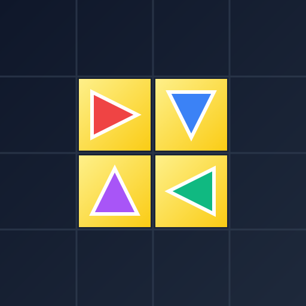

# Draw with Karel

Welcome to **Draw with Karel**, final project submission for **Code-in-Place**! 
This project is modular so that new programmers can easily read, understand, and tweak the code.

## How the World Works

This is a grid-based painting game.
- You place "Karels" (or other characters) on the grid.
- Each character has a direction it is facing.
- If you arrange the characters so they point to each other in a closed loop (or a "chain" that leads into a loop), you can press **Play** to watch them physically slide around the track!
- The game uses "Pac-Man" wrapping, meaning if a shape points off the right edge of the board, it connects to the left edge.

## Controls

- **Left Click**: Place a character on the board.
- **Left Click (on existing character)**: Rotate the character 90 degrees clockwise.
- **Left Click & Drag**: Draw multiple characters quickly.
- **Right Click**: Delete a character.
- **Scroll Wheel**: Zoom in or out to make the grid larger or smaller.
- **Play Button**: Start the animation!
- **Speed Button**: When the animation is playing, a tiny button appears on the top-left-most cell of any valid loop. Click it to cycle the speed (> Slow, >> Fast, >>> Super Fast).

## Code Structure

This project is broken into several small Python files. This makes it easy for kids and beginners to learn how different parts of a program talk to each other:

1. **`main.py`**: The entry point. It sets up the window and binds your mouse clicks to code functions.
2. **`ui.py`**: Draws the grid, the bottom dashboard, buttons, and the characters.
3. **`character.py`**: Contains the math to draw the classic Karel shape and dynamically loads custom plugins.
4. **`characters/` folder**: A folder full of Python files! Any Python script defining a `draw_custom_character` function in here is automatically loaded into the game!
5. **`path_finding.py`**: Contains the logic to figure out if the characters form a loop. It uses very basic `for` and `while` loops!
6. **`animation.py`**: Handles the smooth sliding math when you press Play.
7. **`world.py`**: Keeps track of where all the characters are stored in memory.
8. **`colors.py`**: A simple file to store HEX codes for the colors.

---

## How to Tweak the Code! (For Code-in-Place Students)

Here are some fun challenges you can try:

### Challenge 1: Add a New Color!
1. Open `colors.py`.
2. Add a new line inside the `COLOR_PALETTE` dictionary, like this: `"Green": "#10B981"`.
3. Save the file and run `main.py`. You'll see your new color button magically appear at the bottom of the screen!

### Challenge 2: Change the Highlight Color
1. Open `colors.py`.
2. Find `HIGHLIGHT_COLOR = "#FEF08A"` (which is Yellow).
3. Change the HEX code to a light blue like `"#BAE6FD"`.
4. Run the game and make a loop to see your new highlight!

### Challenge 3: Draw Your Own Character!
1. Open the `characters/` folder and create a new Python file, for example, `my_star.py`.
2. Look at `characters/arrow.py` to see how we define the `draw_custom_character` function.
3. Add your own `canvas.create_polygon` math to draw your shape.
4. Run the game (`python main.py`). The game will automatically detect your new file and add "My Star" to the dropdown menu!
5. **Bonus**: Try using the "Generate with AI..." button in the app to have an AI build the Python file for you!

### Challenge 4: Change the Rules of the World
1. Open `path_finding.py`.
2. Currently, Karels cast a "ray" in a straight line until they see another Karel.
3. Can you modify the `find_next_karel_in_line` function so it only looks exactly *one* step ahead? (Hint: remove the `while` loop and just check `steps_taken == 0`).

Have fun experimenting and breaking the code!

---
*Submission by Anshuman Singh*
